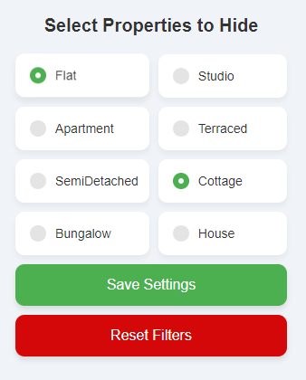
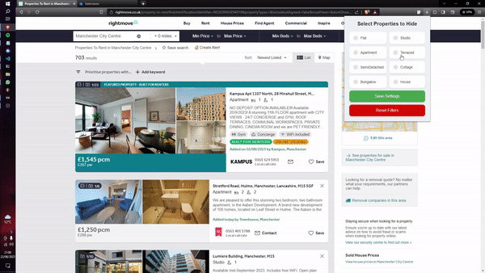

# rightmove-remove
For some reason Rightmove only allows select filtering, this is a more advanced filtering tool to filter search results on Rightmove.
  

  

# Setup
1. This currently isn't a public extension, so you'll have to download the repository and go to your browser extensions, usually your browser name followed by ://extensions e.g. chrome://extensions
2. Turn on developer mode, this should be on the top right of your extensions page
3. Click "load unpacked" and select the downloaded folder
4. Done! Now perform a search on Rightmove and filter with this extension.
